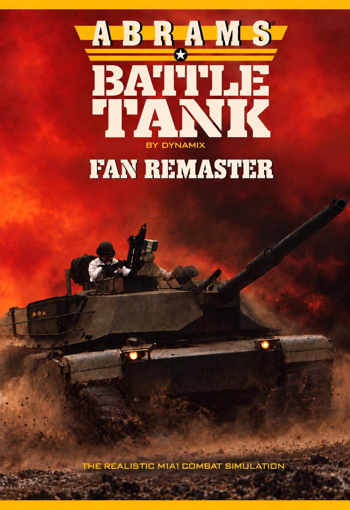
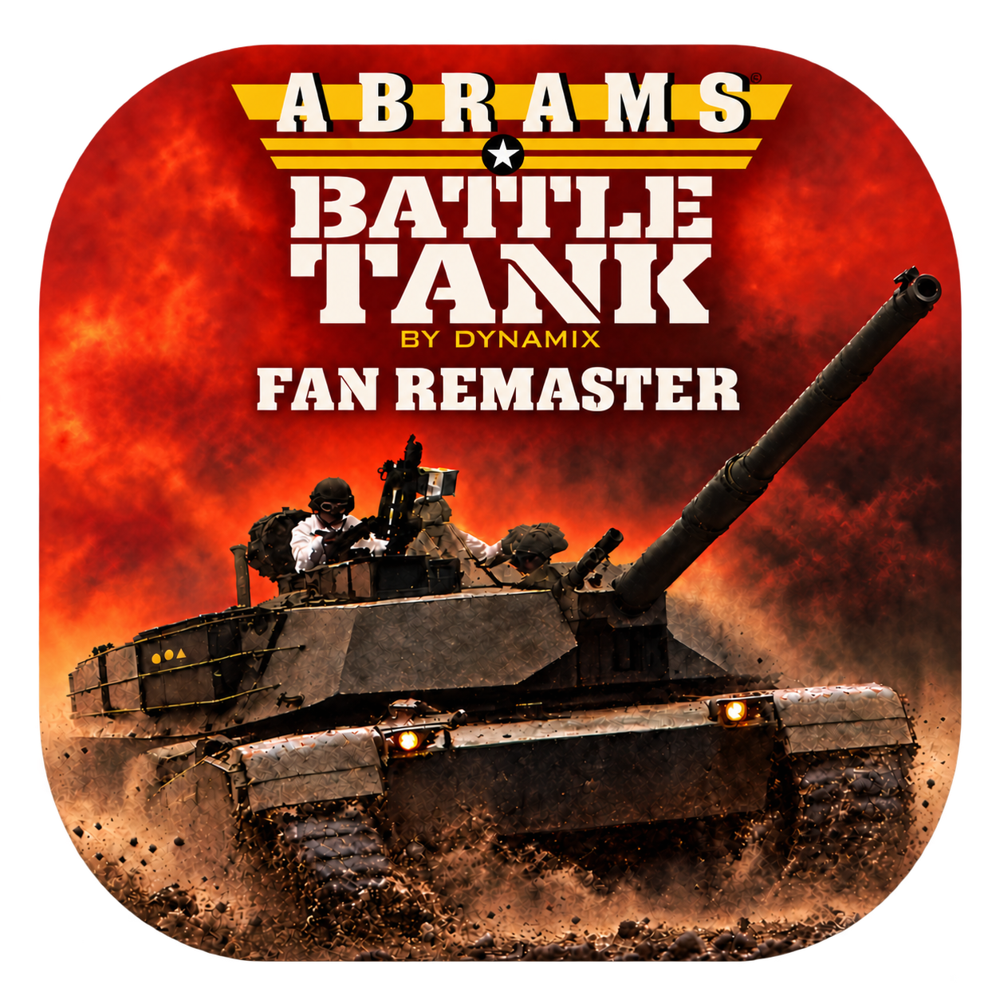
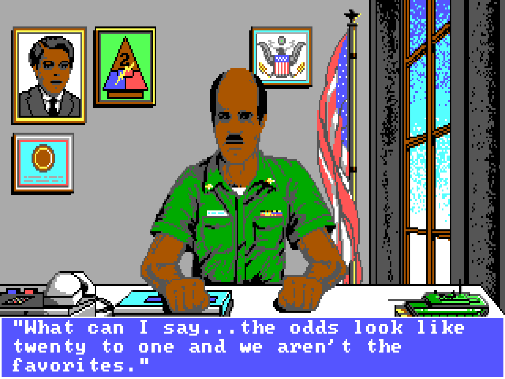
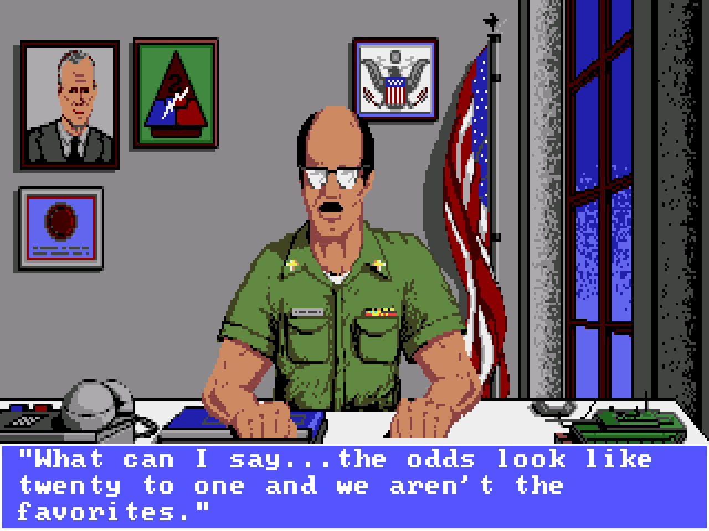
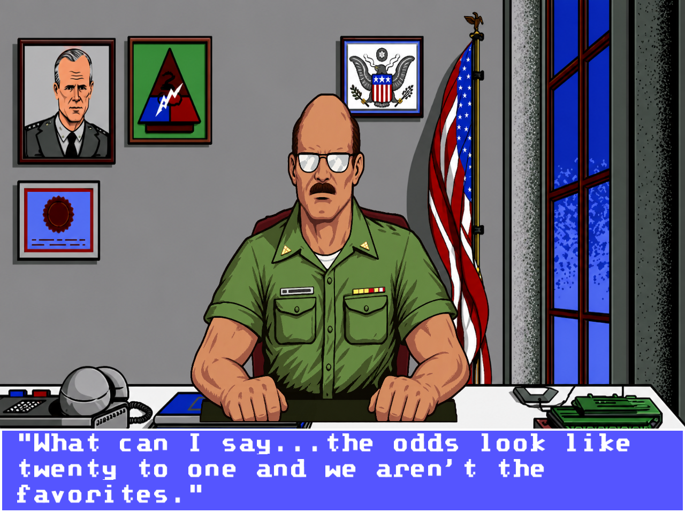
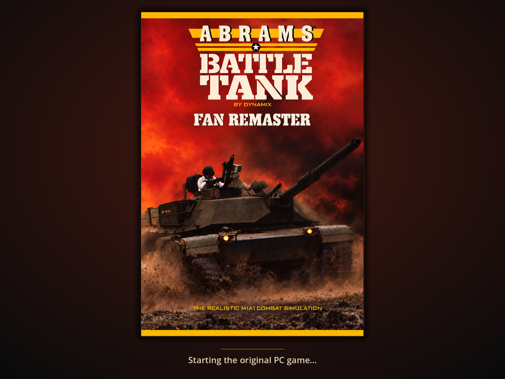

# M1 Abrams Battle Tank Fan Remaster

A high-resolution Godot fan remaster of Dynamix's **Abrams Battle Tank**, powered by the original PC game.

**Dedicated to the memory of David “Ming” Kenny.**

## Original creators

**Original game by Dynamix, published by Electronic Arts.**

| Contribution | Creator |
| --- | --- |
| Director and design | Damon Slye |
| Simulation | David McClurg |
| Product shell | Richard Rayl, Greg Volkmer |
| Artistry | Kobi Miller, Cyrus Kanga |
| World creation | Jerry Luttrell |
| Producer | Rich Hilleman |

Original game copyright 1988, 1989 Dynamix, Inc. The original intro credits are retained. The full credits also appear in About and the offline player guides.

**Fan Remastered by Nell Watson.**

## Artwork and screenshots

<p align="center">
  
  &nbsp;&nbsp;
  
</p>

Colonel Wilson's office in three graphics modes. Click an image for full resolution.

| EGA | Genesis | Upscaled |
| --- | --- | --- |
| [](docs/images/colonel-ega.png) | [](docs/images/colonel-genesis.png) | [](docs/images/colonel-upscaled.png) |

<p align="center">
  
</p>

## About

This project revisits a childhood favourite with restored artwork, original-style lettering, new sound effects and expressive crew speech. The Genesis version provides the visual basis wherever suitable artwork exists. The more complex PC version supplies the gameplay.

The two run in tandem: the original PC executables run inside DOSBox Pure, while Godot presents their output through a Python bridge. Missions, combat, enemy behaviour, ammunition, fuel, damage and campaign progression remain under the original game's control.

## Features

* High-resolution cockpits, portraits, briefings, information screens and ending newspapers, retaining the original visual style.
* Reconstructed typefaces, animated intro credits and a memorial dedication.
* Instant switching between **EGA**, **Genesis**, **Upscaled** and the experimental **Modern** graphics.
* Sample-based sound effects, new music arrangements and generative crew speech, with separate volume controls.
* Five save-state slots, quick save/load and **Undo last load**, alongside the original campaign saves.
* **8x fast forward, toggled with Tab**, with sound muted during accelerated play.
* Resizable windows and fullscreen, preserving the complete 4:3 display.
* **4× MSAA and 16× anisotropic filtering** for remastered scenery, adjustable in Graphics.

Upscaled is the default. Genesis mode uses original-resolution Genesis artwork where available; unmatched areas keep PC graphics. Modern adds source-bound low-poly vehicle and building detail, illustrated trees and a restrained battlefield palette. The original PC simulation, terrain and camera remain authoritative. Modern remains experimental while performance tuning and playtesting continue.

## Install

Standalone packages target **Apple Silicon macOS 14+**, **Windows x86_64** and **Linux x86_64**. Godot and Python are bundled; players do not need to install them.

**You must supply the original PC game. The Genesis ROM is optional. Neither is bundled.**

1. Download your platform's ZIP from [GitHub Releases](https://github.com/NellInc/Abrams/releases), extract it, and open `M1 Abrams Battle Tank Fan Remaster.app`, `M1 Abrams Battle Tank Fan Remaster.exe` or `M1 Abrams Battle Tank Fan Remaster.sh`. On macOS, move the app to Applications.
2. Open Abrams and choose **Choose PC folder…** or **Import PC folder** and select the extracted folder containing `ABRAMS.COM`, `SIM.EXE` and the remaining game files.
3. Optionally choose **Add Genesis ROM…** or **Import Genesis ROM** to enable the Genesis-based artwork and music.
4. Click **Play**.

The importer checks the supported editions and leaves your originals unchanged. Without Genesis, EGA, PC-only Upscaled and Modern remain playable, with high-resolution lettering and crew speech; Genesis-based graphics and music stay disabled.

These are alpha packages. macOS notarization is pending; Windows signing is not supplied. Intel Macs are not supported. See [macOS installation](docs/standalone-macos.md), [Windows/Linux installation](docs/standalone-portable.md) and the release notes for platform testing status.

## Controls

| Action | macOS | PC mapping |
| --- | --- | --- |
| Quick save to slot 1 | **Cmd+S** | **Ctrl+Alt+S** |
| Quick load from slot 1 | **Cmd+L** | **Ctrl+Alt+L** |
| Undo last load | **Cmd+Shift+L** | **Ctrl+Alt+Shift+L** |
| Cycle graphics | **Cmd+G** | **Ctrl+Alt+G** |

The **Session** menu provides all five save slots and normal/8x speed. **Graphics** selects a mode directly; **Audio** controls the mix. **Help** opens the in-app keyboard sheet, searchable scenario/vehicle field guide and original credits. The loading screen and setup offer the same offline guides. Printable PDFs are bundled, with larger, bold command labels, restored manual side views, Modern model studies and original manual maps alongside maps drawn from the original PC terrain. On macOS these are in the system menu bar. The game continues while a remaster menu is open, so pause first when needed. Original game controls remain unchanged.

Save states restore both the running game and campaign disk. New checkpoints also preserve the remastered display. Saves live outside the app in the platform's player profile. Back up the whole profile before upgrading; checkpoints require a compatible core and game edition. See [controls and save behaviour](docs/play-controls.md).

## Development

A fresh clone needs separately supplied game files, local presentation assets and a built tracing core. Follow [source setup and packaging](docs/packaging.md). Source development requires Python 3.10+ with Pillow, Godot and Apple's native build tools; current local testing uses Godot 4.7.2.

From an equipped checkout:

```sh
./Play.command
./Play.command --fullscreen
./Play.command --graphics ega
./tools/validate.sh
```

`Play.command` runs the original game. The Godot editor's default scene is a separate development range. Checkout saves default to `artifacts/pc-boot-viewer/saves/`; preserve them when clearing test output.

* `godot/`: presentation, audio, controls and rendering tests.
* `tools/`: emulation bridge, resource extraction and packaging.
* `tests/`: Python tests.
* `docs/`: setup, architecture, asset workflows and test results.

[Architecture](docs/simulation-contract.md) · [Graphics coverage](docs/graphics-coverage.md) · [Audio](docs/pc-audio-research.md) · [Build status](docs/playability-status.md) · [Installation and recovery](docs/install-recovery.md)

## Project status and contributions

Development is active. Remaining work includes sustained playback performance, complete mission and campaign testing, listening and art review, and wider hardware testing. Unsupported artwork and transitions retain the original PC graphics.

Contributions should preserve original gameplay and include relevant tests or screenshots. Keep original games, ROMs, extracted resources, saves, private builds and credentials out of Git.

## Rights and original game requirement

This is an unofficial, independent fan remaster, unaffiliated with Dynamix or the original game's rights holders. The project claims no ownership, moral rights or other rights in the original game, its content, names or trademarks. Those rights remain with their respective holders.

The remaster is provided free of charge. Its own code is MIT-licensed (emulator modifications are GPL-2.0-or-later), and its original artwork/audio contributions are dedicated under CC0; those terms do not grant rights to the original game or third-party material. See [the project notice](NOTICE.md) and [rights and dependencies](docs/release-rights.md).

**The remaster cannot run without a separately obtained, supported copy of the original PC game.** No original PC game or Genesis ROM is included. A Genesis ROM is optional and cannot replace the PC game.

The software is provided as is, without warranty. Back up your profile before upgrading.
